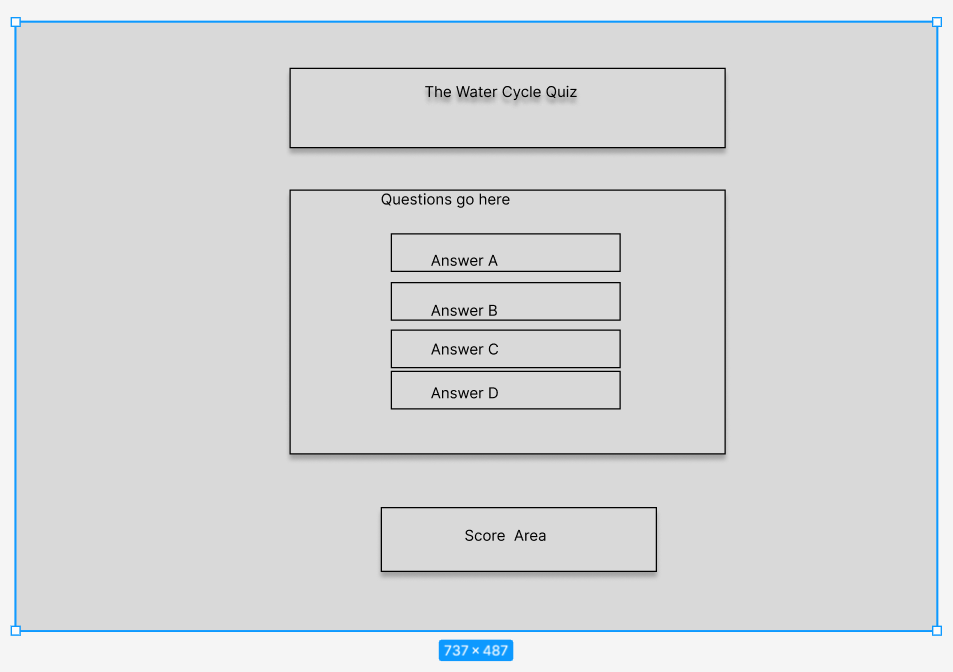
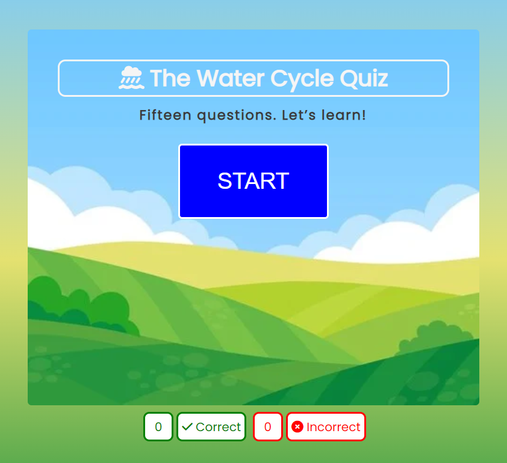
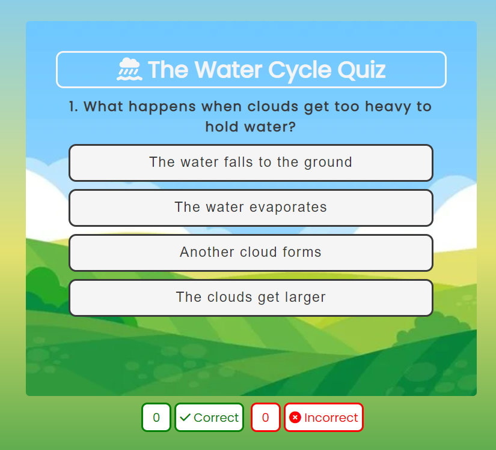
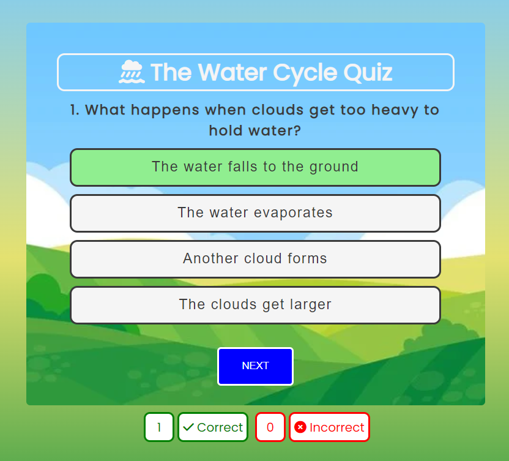
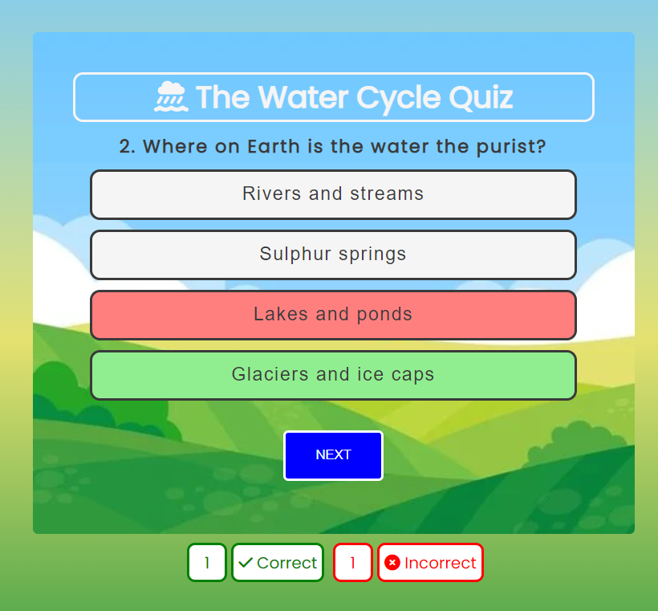
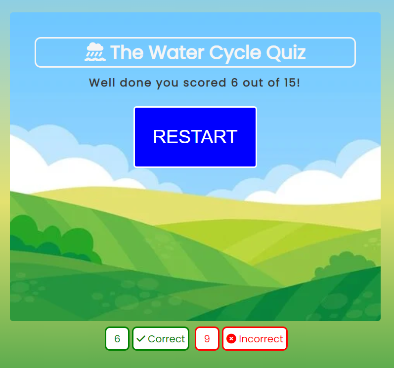
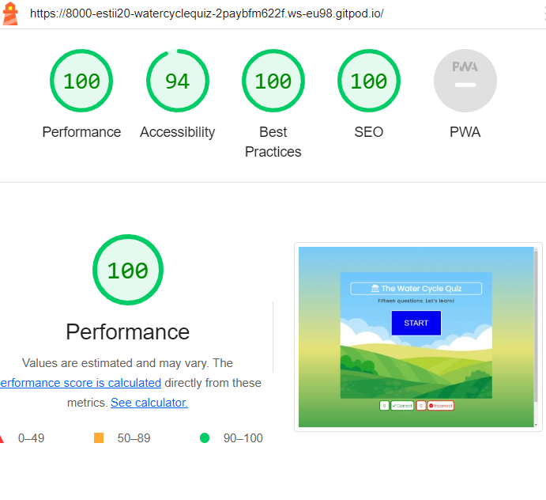
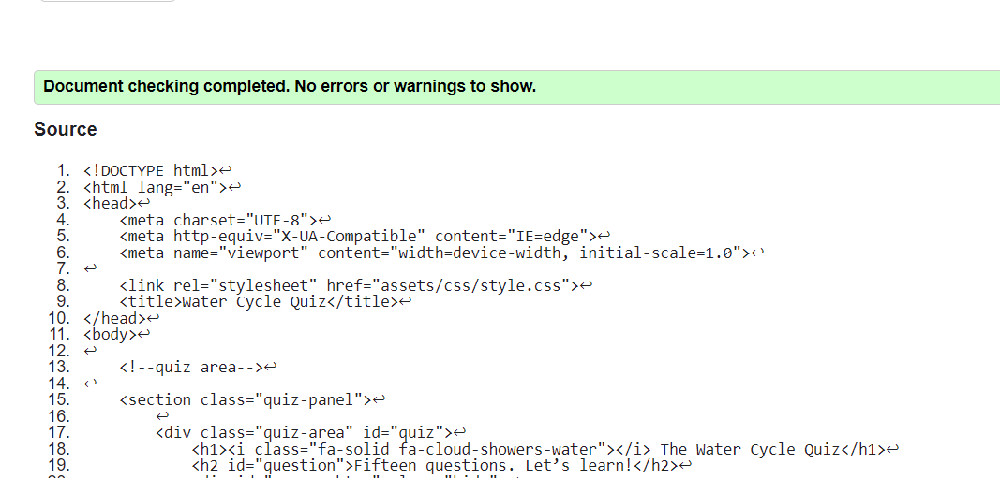
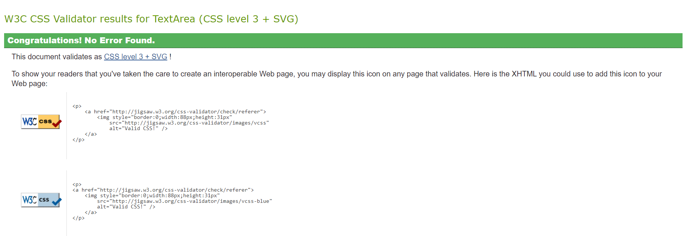
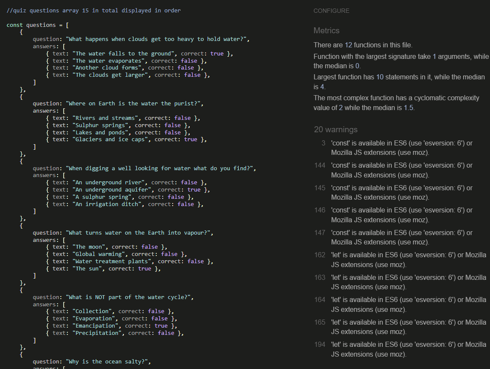

# Water Cycle Quiz

A quiz to test the key concepts of the water cycle for primary school children, KS2 aged between 7 and 11 years. A fun way to put into practice what the children have learnt in class. An online quiz format is more interactive for children and suits visual learners in particular. Ideal for students and teachers who learn and teach remotely.

This quiz asks questions about the water cycle namely; evaporation, condensation, precipitation and ground runoff.
The questions will test the knowledge of how Water is recycled in a process called the water cycle. 
Evaporation - water in the sea rises as vapour into the sky. 
Condensation - droplets form and become clouds. 
Rain (precipitation) falls onto the ground from clouds. 
Water runs off the land until it reaches a river. 
Water moves  along the river and into the sea.
The process begins again.

## Portfolio Project 2

- [Water Cycle Quiz Link](https://ui.dev/amiresponsive?url=https://estii20.github.io/water-cycle-quiz/)

- [Github Link](https://github.com/estii20/water-cycle-quiz)

- [Live Site](https://estii20.github.io/water-cycle-quiz/)

## Table of contents

1. UX design
2. Features
3. Future Features
4. Technology used
5. Accessibility
6. Testing
7. Deployment
8. Credits
9. Acknowledgements

### UX Design

To attract children to learn and interact with the information they have learnt at school.
A background picture of land and sky to give a bright and enticing look to the quiz.

__Header - Logo__

Font Awesome logo taken to show the clouds, water and sea. Represents the subject matter.

__Question Area__

There are fifteen questions.
As the player moves through the questions, there is a notification on which question they are on taken from the question index.
Answer correct, response the button correct shows a green background and if incorrect the correct answer displayed as green and the chosen wrong answer has a red background.

__Score Area__

Documents the number of questions correct and incorrect.

### Aims

- Offer children the opportunity to practise their knowledge.
- Support teachers in explaining the concepts and testing students.
- Provide a fun learning tool which children enjoy learning.
- Help children with different learning styles a different way of understanding the water cycle.
- Give teachers a tool to know what the children understand.

### Skeleton

Webpage and mobile version made using a wireframe tool on [Figma](https://www.figma.com/)

### Surface

To create a clear visual platform for the quiz game, that is attractive to young players.

### Background color

The main background is a linear gradient to complement the background image. 
The [eyedropper tool Chrome extension](https://chrome.google.com/webstore/detail/eye-dropper/hmdcmlfkchdmnmnmheododdhjedfccka?hl=pt) was used to pick out the main three colors for the background.
The green color of `#79caff`, the beige color of `#e4e170` and the blue color of `#1a913d`. 

The Heading and Logo color are `#f5f5f5` and give the visual impression of a cloud floating in the sky of the background image.

The answer buttons have a background color of `#f5f5f5` a whitesmoke color to provide a contrast to the text without being as harsh on the eyes as white.

The hover color used for the buttons is also `#e4e170`, to give a cohesive visual. 

The next button and start button are `#0000FF` a bright blue to contrast well with the background colors.

The quiz area background uses the background image of hills and sky to complement the subject of the water cycle.

[Colorspace](https://mycolor.space/) used to check the palette works together.

### Font color

The heading and logo are `#f5f5f5` to create a contrast to the background blue and the main text content.

The body font used is the charcoal font-color `#3a3a3a` to add contrast to the background color.

### Fonts

- The font Poppins used throughout to give a clean look for the user.
- Used [fontjoy](https://fontjoy.com/) to find the font for the logo and headings.
- Fonts imported from [Google Fonts](https://fonts.google.com/).
- [Font Awesome](https://fontawesome.com/) used to add visual cues to the Logo and score area.

## Features

### Start quiz

- The heading section has a Logo with font awesome image of clouds, rain and sea and the name of the quiz.
- Number of questions displayed and motivational message to players.
- Start button call to action, with the motivational message "Let's learn!"
- Score area

An event listener waits for a click on the start button. The start button shown waits for a click and shows the start button in the quiz area and the score area tally.

Once the quiz starts, the first question from the question list displays, the next button appears and the start button is hidden using CSS display none.

The function to begin the quiz iterates through the questions array and displays each in order. There are fifteen in total.

### Quiz area

- Features the fifteen water cycle questions. 
- Four option buttons with three incorrect answers and one correct answer and a start button. As the player moves through the game there is a next button.

The function to display the questions creates buttons to display the answer text, then checks if the answer is correct from the question index. The answer is then selected when the user clicks and the answer buttons are appended.

### Answer correct or incorrect

Responds if the player is correct or incorrect, by highlighting the correct answer button as green.

 
The function select answer then selects the answer from the four answer options in the question array.
 
The wrong answer button selected is highlighted red and the correct answer not seleected is highlight as green.

Hover on the buttons is disabled on selecting an answer so that the user can only choose to click on the next button.

### Score Area

Once the answer is either correct or incorrect the old score is adjusted accordingly as correct and incorrect. 

Lets the player tally the number of questions they have correctly or incorrectly answered during the whole time of play, even when retsarting the quiz for a new attempt.

Once all the questions are complete, the function to reset the quiz, resets the state to the default.

### Replay Quiz

The display score function is called once the fifteen questions are completed. The score and the question list are reset to zero. The final score is shown in the quiz area and the restart button is displayed, as a call to action to replay the quiz.

## Future Features

It would be helpful in the future to increase the number of questions and provide a random question function.

## Technology Used

__HTML__

Provides structure to the content.

__CSS__

Provides style to the content and user accessibility. Media queries to adjust to
different screen sizes.

__JavaScript__

The language used to add interactivity to the quiz.

__Font Awesome__

[Font Awesome](https://fontawesome.com/)
Provides visual cues to the user and is used for the correct/incorrect answer icons.

__Favicon__

[Favicon](https://favicon.io/) to create the icon for the webpage tab.

__Fontjoy__

[fontjoy](https://fontjoy.com/) to find the font for the quiz.

__Google Fonts__

The entire website used Google Fonts, with font joy helping to find a suitable font.

__Chrome Eye Dropper Extension__

[eyedropper tool Chrome extension](https://chrome.google.com/webstore/detail/eye-dropper/hmdcmlfkchdmnmnmheododdhjedfccka?hl=pt)To find the colors for the fonts and background colors from the main background image.

Sans-serif used as an alternative in case of issues viewing on different browsers.

__Convertio__

To change images from jpeg to webp available at
[Convertio](https://convertio.co/download/66c2e566ed18555e5e989956c82474de81cdf7/)

__Image Resizer__

[Image Resizer](https://www.simpleimageresizer.com/upload) to resize the background image used for the quiz area.

__Wireframes__

[Figma](https://www.figma.com/) to design the arrangement of the site.

__Colorspace__

[Colorspace](https://mycolor.space/) used to check the palette works together.

__Mobile Friendly__

[Mobile Friendly](https://search.google.com/test/mobile-friendly) to check for mobile design/

__Browser Stack__

[Browser Stack](https://live.browserstack.com/) to test the site on different browsers.

__Lambda Test__

[LAMBDA Test](https://app.lambdatest.com/) to test the site on different browsers.

## Accessibility Features

Text color chosen contrasts well to the background color to improve user visibility.

Semantic HTML to define the different sections of the quiz.

## Testing

| Test | Outome |
| --- | --- |
| The questions display in order | Pass |
| The correct answer displays | Pass |
| The incorrect answer displays | Pass |
| The score tallys correctly | Pass |
| The start button when clicks works | Pass |
| The next button functions | Pass |
| The restart button resets the questions to zero | Pass |
| Content is responsive in smaller and larger screen sizes |  |

__Further testing__

My children aged 7 and 10 tested the quiz.

Tested on different browsers to ensure functionality.

## Bugs and Fixes

1. Dev tools in Chrome showed that the height of the quiz area and score area needed to be smaller so that it displays the full quiz content on a small screen. Therefore a media query for small screens was added so that the font is smaller and the height of the quiz answer buttons are reduced in height to accommodate the answers but still be legible to the player. The score tally is hidden so that only the numbers are displayed on mobile screens.

2. The quiz panel was gaining in height when the next button displayed so the height of the quiz panel was increased to accommodate the additional button.

3. The buttons for the quiz panel needed to be removed from the start game, so it was necessary to use CSS to hide the area from the start of the game.

4. The orientation of the screen caused the background color to only fill 60% of the height of the screen so I changed the view height to min screen instead of max screen.

__Browser Test__

[Browser Stack](https://live.browserstack.com/) and [LAMBDA Test](https://app.lambdatest.com/) used to test the quiz on different browsers. Firefox the browser displays the Score Area and Start/Next buttons to the left of the quiz container, however it is still visible to the player.

## Unfixed Bugs

Tests on Browser Stack failed to load the quiz in a Kindle Fire HDX7. Displays error. Further research necessary to fix this issue.

__Validators__

[W3C HTML Validator](https://validator.w3.org/)

I ran code through the HTML validator and it was displayed an error as the second section of the score area. The suggestion by the validator was to add a header, so I changed the `
` tag to a `<h2>` tag to resolve the issue.
I then ran my updated code back through the HTML validator and I found no errors.

[W3C CSS Validator](https://jigsaw.w3.org/css-validator/)

Putting the CSS code through the validator I found no errors.

[JSHint](https://jshint.com/)

Whilst running the Javascript code through JS Hint, it showed three errors for unused variables, I subsequently removed the unnecessary variables that were still in my code and these errors were rectified. 
Warnings that const, let, arrow function syntax (=>) and template literals used in my JavaScript showed ECMAScript 6 specific syntax. Suggested to use esversion 6.  

__Mobile Friendly Test__

Ran the URL through the website [Mobile Friendly](https://search.google.com/test/mobile-friendly) and it passed.

## Deployment 

To access this project in GitHub;

1.  Firstly Log into [Github](https://github.com/).

2.  Select repository [estii20/water-cycle-quiz](https://github.com/estii20/water-cycle-quiz).

3.  Select settings from menu.

4.  Select Pages from left menu bar.

5.  Scroll and select Master branch from the drop down menu to deploy the website.

6.  Retrieve the automatically generated link from the GitHub pages section.

__Running the project locally;__

1.  To create a clone of this project follow the instructions below;

2.  Create a GitPod account [Gitpod](https://gitpod.io/login/).

3.  Open the Chrome browser.

4.  Click to the top of the Chrome navigation bar and enable the extension Gitpod Browser Extension for Chrome. 

5.  Link it.

6.  Restart the browser when prompted to do so.

7.  Log into GitPod with your account username and password.

8.  Select the project in GitHub repositories.

9.  Click on the green “Gitpod” button to the top right of the page.

10. A new gitpod workspace opens.

11. It is now possible to work locally on the project.

To make updates, it is necessary to commit with commit-m and push with git push so that the updates are pushed to Github. 

Cloning the project will link the changes to the project repo and will be sent for approval.

Forking the project will create a new repo and the code will belong to the user. Any changes made will notify the user and will give them the option to pull this new code to their repo. 

Changes pushed to the main branch will automatically update on the site.

## Credits

__Content__

Question and answer content information researched at
[Education quizzes KS2 Science The Water Cycle](https://www.educationquizzes.com/ks2/science/the-water-cycle/)

[Cape Cod Groundwater Organization Water Cycle PDF](https://www.capecodgroundwater.org/wp-content/uploads/2020/05/Correct-Answers-Water-Cycle.pdf)

[Proprofs.com water cycle quiz](https://www.proprofs.com/quiz-school/story.php?title=water-cycle_35 )

__Media__

Background image taken from [Beautiful landscape farm field vector illustration](https://www.freepik.com/premium-vector/beautiful-landscape-farm-field-vector-illustration-rural-summer-meadow-sunny-day-flat-cartoon-style_33189092.htm#query=hills%20sky&position=32&from_view=keyword&track=ais)

Icons were taken from [Font Awesome](https://fontawesome.com/)

__Resources__

Background color [W3school CSS Gradients](w3schools.com/css/css3_gradients.asp)

Start quiz button [Web Dev Simplified Quiz start button with JavaScript](https://myoutube.com/watch?v=riDzcEQbX6k&feature=share)

Functions for questions and answers [Easy Tutorial Pro Quiz question and answer buttons with JavaScript](https:youtube.com/watch?v=PBcqGxrr9g8&feature=share)

Score area [Love Maths Score Area, Code Insitute](https://github.com/Code-Institute-Solutions/love-maths-2.0-sourcecode)

Event Listeners [Stackoverflow DOM Content Loaded Event Listeners](https://stackoverflow.com/questions/67605697/jest-mock-addeventlistener-dom-content-loaded-for-tests-inside-this-check) and
[MDN Web Docs](https://developer.mozilla.org/en-US/docs/Web/API/Window/DOMContentLoaded_event)

Answers not showing [Stackoverflow](https://stackoverflow.com/questions/72873577/creating-a-javascript-quiz-web-app-why-wont-the-answer-options-show-under-each)

## Acknowledgements

Mentor - Brian Macharia

Support of Code Institute Team

